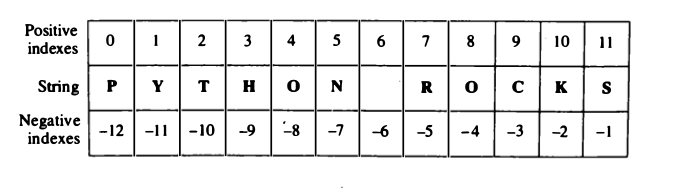

# Strings
A string is an ordered sequence of characters. Here are a few characteristics of strings:
 * A string has a length. Get the length with the len() built-in function.
 * A string is indexable. Get a single character at a position in a string with the square bracket operator, for example mystring[5].
 * You can retrieve a slice (sub-string) of a string with a slice operation, for example mystring[5:8].
 * Create strings with single quotes or double quotes. 
 
## Operators on strings
You can concatenate strings with the "+" operator.
You can create multiple concatenated copies of a string with the "*" operator.
And, augmented assignment (+= and *=) also work.
Examples:
```
>>> 'cat' + ' and ' + 'dog'
'cat and dog'
>>> '#' * 40
'########################################'
>>>
>>> s1 = 'flower'
>>> s1 += 's'
>>> s1
'flowers'
```
## Repetition
The next operator we can apply to a string is the repetition operator (*).

```
>>> 'go'*3
'gogogo'
>>> 'go'*3+'twins'*2
'gogogotwinstwins'
>>> 'go'*3+' twins'*2
'gogogo twins twins'
>>> 
```
 
 
## The in operator
The word in is a boolean operator that takes two strings and returns True if the first appears as a substring in the second:
```
>>>'a' in 'banana'
True
>>>'seed' in 'banana'
False
```
## format method
   * Sometimes we may want to construct strings from other information. This is where the format() method is useful.
   * A string can use certain specifications and subsequently, the format method can be called to substitute those specifications with corresponding arguments to the format method.

```
	age = 20
	name = 'Danny'
	print('{0} was {1} years old when he wrote this book'.format(name, age))
	print('Why is {0} playing with that python?'.format(name))
```
output:
```
	$ python str_format.py
	Danny was 20 years old when he wrote this book
	Why is Danny playing with that python?
```

## Escape Sequences
   * Suppose, you want to have a string which contains a single quote ('), how will you specify this string? For example, the string is "What's your name?". You cannot specify 'What's your name?' because Python will be confused as to where the string starts and ends. So, you will have to specify that this single quote does not indicate the end of the string. This can be done with the help of what is called an escape sequence.
	* you can specify the string as 'What\'s your name?' or "What's your name?"
        * the newline character - \n
		
```
			'This is the first line\nThis is the second line'
```
output:
```
			"This is the first line. 
			This is the second line"
```
The tab: \t

eg:
```
			'This is the first line\t\t\t\t\tThis is the second line'
```
output:
```
			"This is the first line      This is the second line"
```
The lists of Escape Characters in Python are:

*    \a: alert
*    \b: backspace
*    \cx: Control X
*    \e: escape
*    \f: Form feed
*    \n: New line or next line
*    \r: carriage return
*    \s: space
*    \t: tab
*    \v: Vertical Tab

```
## Strings are immutable
It is temp
ting to use the operator on the left side of an assignment, with the intention of changing a character in a string. For example:
```
>>> greeting = 'Hello, world!'
>>> greeting[0] = 'J'
TypeError : 'str' object does not support item assignment
```

## Indexing
We next examine the index operator [] , an operator that has no mathematical counterpart.
This operator is useful when we want to get at particular characters in a string.




```
>>> 
>>> name = "Venkata Teja"
>>> first = name[0]
>>> first
'V'
>>> second = name[8]
>>> second
'T'
>>> 
```
## Slicing
The slice operator [ : ] is similar to the index operator except that it can get multicharacter
parts of the string.

```
>>> name = "Venkata Teja"
>>> name[0:6]
'Venkat'
>>> name[8:]
'Teja'

```

